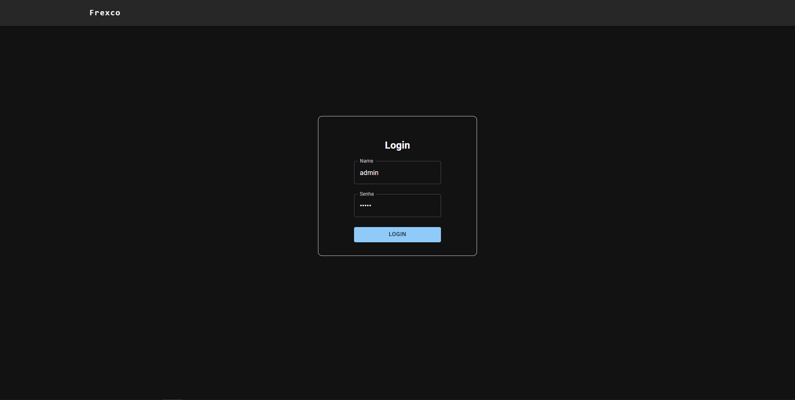
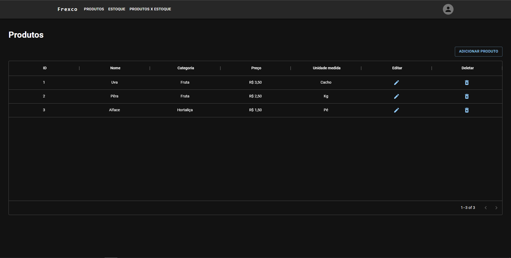
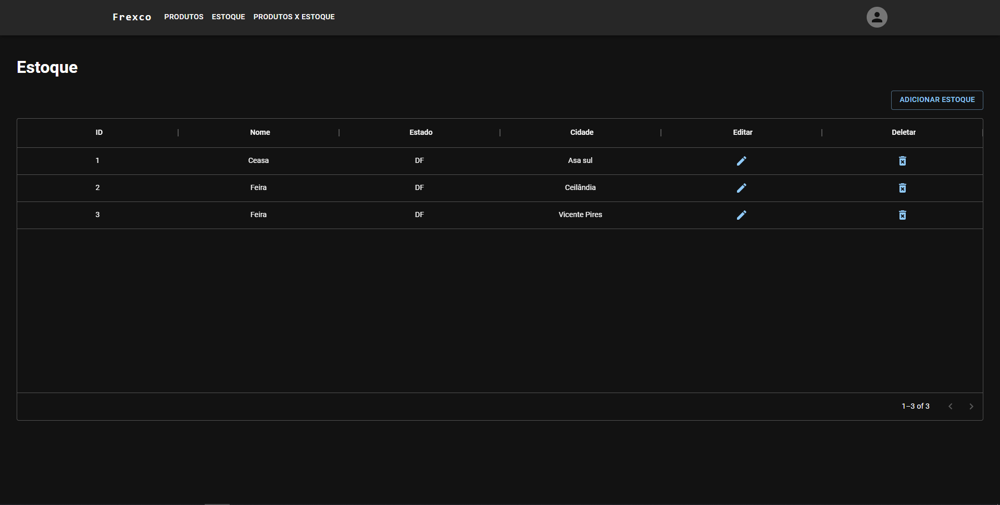
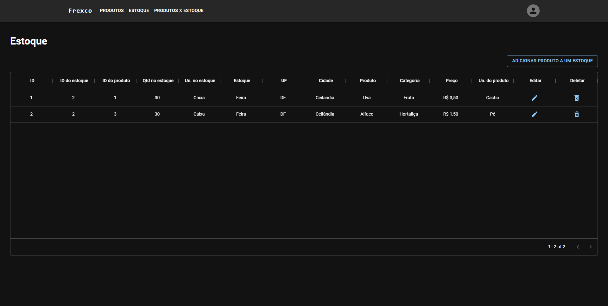

<h1 align="center">
  <p align="center">Estoque - Frexco</p>
  <a href="https://www.frexco.com.br/"></a>
  
  [](./LICENSE)
  
  
  
</h1>

Este projeto tem como objetivo simular uma aplicação de estoque, manipulando produtos e estoque e seus respectivas relacionamentos.

## 📁 Acesso ao projeto

**Indique como é possível baixar ou acessar o código fonte do projeto, seja projeto inicial ou final**

Para acessar o projeto basta executar os comandos abaixo:

```bash
git clone https://github.com/italovinicius18/FrexcoDesafioFullStackDeveloper.git
```

```bash
cd FrexcoDesafioFullStackDeveloper/
```

## 🛠️ Abrir e rodar o projeto

### Requisitos

Para executar o projeto você necessita ter o docker-compose instalando em seu dispositivo, caso não tenha, pode acessar este <a href="https://docs.docker.com/compose/install/">link</a> e seguir as instruções de instalação

### Execução

Para executar o projeto basta executar o comando na raiz do projeto

```bash
docker-compose --build
```

Aguarde o processo de instalação e execução ser feito.

### Acessar a aplicação

Para acessar a aplicação, basta acessar o http://localhost:3000/ e a partir daí pode utilizar a aplicação.

### Login

O login utilizado para acessar a aplicação é 

Nome: admin
Senha: admin

obs: muito seguro né ? kkk

## ✔️ Tecnologias utilizadas


## 📸 Imagens da aplicação

<p align="center">
  
</p>

<p align="center">
  
</p>

<p align="center">
  
</p>

<p align="center">
  
</p>

## Autores

| [<br><sub>Ítalo Guimarães</sub>](https://github.com/italovinicius18) |
| :---: |
